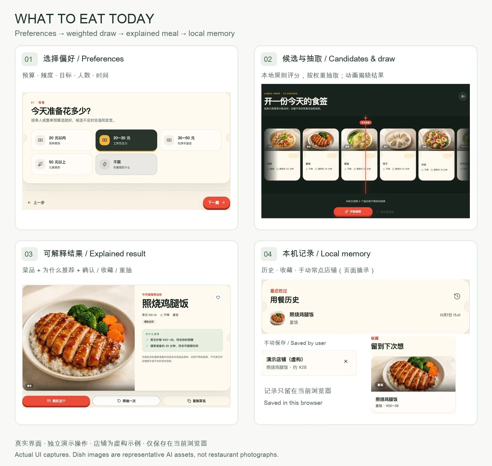
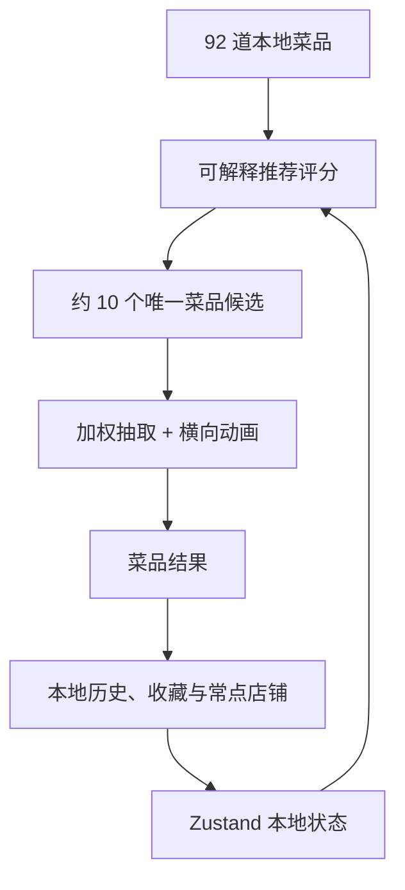

# 今天吃什么 · What to Eat Today

[Live Demo](https://hql7-luo.github.io/what-to-eat-today/) · [GitHub Repository](https://github.com/hql7-luo/what-to-eat-today) · Version: `v0.1.0`

一个把“今天吃什么”变成**偏好筛选 → 可解释加权推荐 → 游戏化抽取**的本地决策工具。回答 5 个问题，从 92 道菜品资料中生成约 10 个候选，得到一份带推荐理由的餐食建议。

A local meal decision tool: five preferences → rule-based candidates → weighted draw → an explained recommendation. No machine learning, location service, or account required.

| 输入 | 我实现的核心流程 | 输出 |
| --- | --- | --- |
| 预算、辣度、饮食目标、人数、可接受时间 | 规则筛选与评分 → 候选去重 → 按分数加权抽取 → 横向动画揭晓 | 菜品、推荐理由、确认 / 重抽 / 收藏，以及本机历史 |

## 产品 walkthrough

[](public/screenshots/walkthrough.webp)

当前版本真实界面摘录；点击放大。演示店铺明确标注为虚构，菜品图为项目已有的代表性 AI 素材，均不是具体餐厅照片。[手机单列版](public/screenshots/walkthrough-mobile.webp) · [截图来源与复现](public/screenshots/README.md)

**体现的能力**：TypeScript / React 产品实现、可解释业务规则、约束与降级设计、状态持久化、交互设计与自动化测试。

**解决的问题**：把开放式选择缩成少量候选，展示“为什么推荐”，并用本机记录减少近期重复。项目不主张已验证的用户行为改善；无需登录，仅推荐菜品，不提供附近餐厅服务。

## 核心功能

- 预算、辣度、饮食目标、用餐人数、可接受时间五步筛选
- 92 道本地菜品、23 个餐饮分类
- 可解释的加权推荐、昨天硬排除、2–3 天降权、本轮结果去重
- 候选不足时逐步放宽饮食目标、时间和预算，辣度与人数保持硬约束
- CS:GO 风格横向滚动抽取，支持减少动态效果、音效和轻震动
- 结果确认、重抽、不想吃、收藏、复制菜名
- 用户可手动维护常点店铺、常点菜品和大致价格
- 历史、收藏、口味偏好和常点店铺仅保存在 localStorage
- 本地半真实美食图与稳定的分类兜底

## 数据边界

本项目不包含以下能力：

- 浏览器定位或地址输入
- 地图、POI 或附近餐厅搜索
- 美团、饿了么等外卖平台 API
- 具体店铺距离、评分、营业状态、实时菜单或配送时间
- 登录、后端数据库、支付和站内下单

菜品价格区间和通常准备时间来自本地菜品资料，只用于偏好筛选和选择参考，不代表任何店铺或平台的实时信息。

结果页的“复制菜名”只把菜品名称写入剪贴板，不会自动打开、抓取或调用外卖平台，也不声称与任何外卖平台存在数据接入。

## 我的常点店铺

“我的口味”页面允许用户手动添加：

- 店铺名称
- 对应的本地菜品
- 大致价格

这些记录不参与推荐权重。抽到匹配菜品时，结果页会优先显示最近保存的匹配店铺。记录只保存在当前浏览器，清除浏览器数据后可能丢失，也不会同步到其他设备。

## 推荐算法

算法位于 `src/lib/recommendation/index.ts`，不使用机器学习。每道菜按以下维度评分：

- 预算与菜品常见价格区间
- 辣度、饮食目标、人数与通常准备时间
- 最近吃过的时间、本轮排除列表、长期分类偏好
- 小幅随机扰动，避免每次候选排序完全相同

关键规则：

- 昨天吃过：硬排除
- 2–3 天前吃过：权重乘以 `0.35`
- 本轮抽过或标记“不想吃”：硬排除
- 历史上标记“不想吃”：权重乘以 `0.28`
- 候选不足：先放宽饮食目标和时间，再放宽预算
- 辣度、人数、本轮排除与昨天记录始终为硬约束
- 最终结果按推荐分数加权抽取，动画只展示预先确定的结果

## 美食视觉素材

候选池、开箱、结果页、收藏和历史统一使用项目内的 AI 生成代表性半真实美食图，不依赖外部图片接口或来源不明的网络照片。这些图片用于表达菜品类型和统一产品视觉，不是任何具体餐厅的真实菜品照片。

- `public/food/dishes/`：高频菜品独立图
- `public/food/categories/`：分类兜底图
- `src/lib/food-image.ts`：菜品独立映射、分类映射和全局兜底
- `src/components/dish-image.tsx`：统一比例、裁切、占位和错误恢复

当前包含 35 张独立菜品图和 17 张分类图。没有独立图的低频菜品会按分类使用统一风格的本地兜底图。

## 本地数据与迁移

Zustand 持久化数据带有明确版本号和字段校验。当前版本为 v3：

- v1/v2 的有效偏好、历史、收藏和分类权重会迁移保留
- 旧版位置、餐厅和实时数据字段不会进入新状态
- 旧版候选与抽取中间状态会清空，避免残留餐厅信息
- JSON 或字段损坏时，原始值会隔离到 `what-to-eat-today:store:corrupt:*`
- 恢复默认状态后 hydration 仍会完成，不会永久停留在加载页

## 技术栈

- Next.js 16.3 App Router
- React 19 + TypeScript
- Tailwind CSS 4.3
- Motion for React 12
- Zustand 5 + localStorage
- Vitest + jsdom
- ESLint + GitHub Actions

## 本地运行

要求 Node.js 22.13+（22 LTS）或 24 LTS，并使用 `package.json` 指定的 pnpm 11.24.0。`.nvmrc` 默认选择 Node.js 24；CI 检查 Node.js 22 和 24。

```bash
pnpm install --frozen-lockfile
pnpm dev
```

打开 [http://localhost:3000](http://localhost:3000)。项目没有 `.env.example`，也不需要创建 `.env.local`。

## 项目架构



主要目录：

```text
src/
  app/                  页面流程
  components/           通用视觉、统一美食图片与流程组件
  data/dishes.ts        92 道本地菜品
  features/store/       Zustand 状态、持久化校验与迁移
  lib/food-image.ts     菜品图片解析与统一兜底
  lib/recommendation/   推荐、降级与加权抽取
  lib/roulette/         可测试的开箱轨道生成
  types/                共享 TypeScript 类型
tests/                  推荐、存储、开箱和图片测试
public/food/            本地半真实美食图片资源
```

## 测试与质量检查

```bash
pnpm lint
pnpm typecheck
pnpm test
pnpm build
```

测试覆盖昨天排除、2–3 天降权、预算、辣度、饮食目标、本轮排除、候选降级、菜品唯一性、加权抽取、Zustand hydration/迁移/损坏恢复、确认幂等、常点店铺持久化、开箱轨道恢复和全部菜品图片映射。

## 部署

项目使用 Next.js 静态导出并通过 GitHub Actions 免费部署到 GitHub Pages：

- 线上地址：[https://hql7-luo.github.io/what-to-eat-today/](https://hql7-luo.github.io/what-to-eat-today/)
- 工作流：`.github/workflows/pages.yml`
- 构建产物：`out/`
- GitHub Pages 项目子路径：`/what-to-eat-today`

`pnpm build` 生成静态文件，不能用 `next start` 启动。日常本地体验使用 `pnpm dev`；预览生产产物时，请让静态文件服务器把 `out/` 挂载到 `/what-to-eat-today/`。

项目没有 API 路由、服务端业务、数据库或环境变量。所有用户个性化数据都只保存在各自浏览器的 localStorage 中。

## License

[MIT](./LICENSE)
